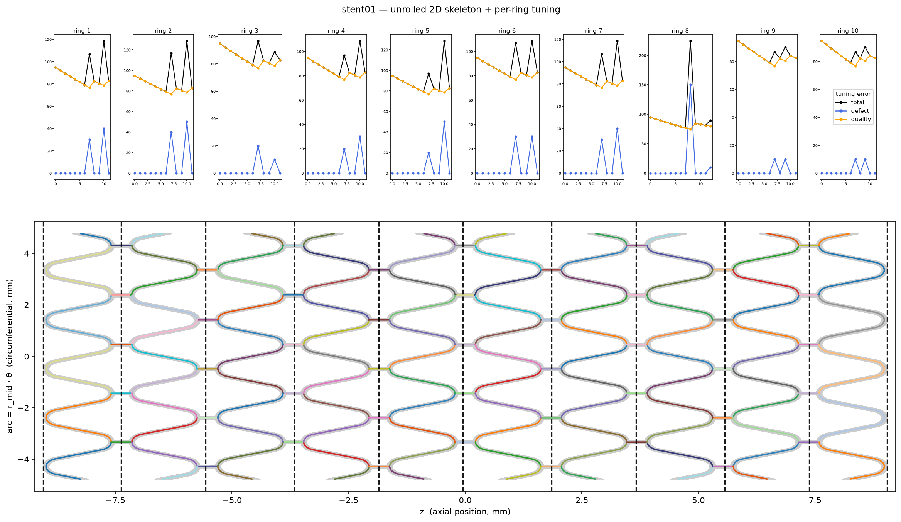
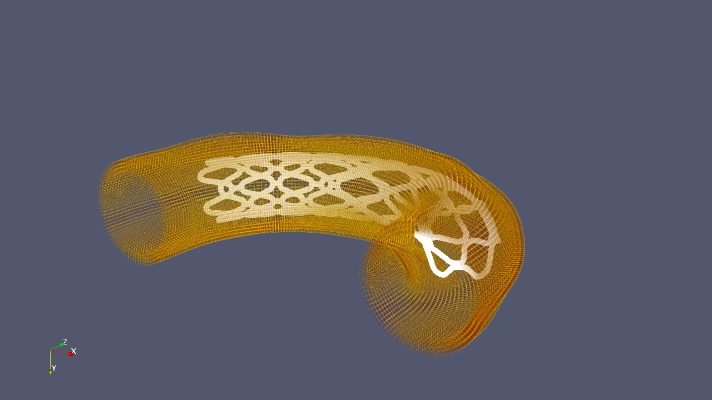

# stentFIT

[](https://stentfit.readthedocs.io/en/latest/?badge=latest)

Semi-automated virtual stent implantation with mixed-dimensional modelling

Full documentation, including the API reference and workflow diagrams, is hosted at [stentfit.readthedocs.io](https://stentfit.readthedocs.io/en/latest/).

`stentFIT` turns a stent surface mesh (`.stl`) into a 1D beam-element model ready for beam-to-solid contact simulation. It samples the stent surface, detects its rings, extracts a 2D skeleton per ring, wraps that skeleton back onto the 3D mid-surface, fits a B-spline to each strut curve, and meshes the result into Simo–Reissner beams with [BeamMe](https://beamme-py.github.io/beamme/). Extracting the stent's 1D wireframe is a semi-automated process: it allows manual edits of intermediate steps such as ring detection and 2D skeletonisation. It also provides a smoke test that verifies the quality of the 1D stent model inside a generated pipe-like 3D vessel.

## Installation

```bash
pip install stentfit
```

Requires **Python 3.13** (pinned to match [BeamMe](https://beamme-py.github.io/beamme/)'s supported range). Core dependencies such as `beamme` (stent beam meshing and artery solid meshing), `gmsh` (artery solid meshing), and `fourcipp` are installed automatically. Running the generated simulation input files additionally requires a compiled **4C** executable, which is not included in this package. 

## What it does & How to use it

**1. Stent skeletonisation** ([`examples/stent_skeleton.ipynb`](examples/stent_skeleton.ipynb))

- Sample a point cloud from the stent STL and align it to its centreline axis.
- Detect rings and skeletonise each ring in 2D (optional auto-tuning + manual edits).
- Wrap the 2D skeleton onto the local mid-surface, clean up the graph, and fit a B-spline per strut.
- Mesh the fitted splines into a 1D Simo–Reissner beam mesh with BeamMe.

Each stage writes `skeleton_points.csv`, `skeleton_splines.json`, `stent_features.json`, and interactive HTML views into the output directory.



**2. Test artery generation & simulation setup** ([`examples/test_sim_generation.ipynb`](examples/test_sim_generation.ipynb))

A synthetic/parametric smoke test exercises the full mixed-dimensional chain end-to-end:

- Generate a parametric test artery (straight / curved / S-bend) sized to the stent, and mesh its wall as a 3D solid with GMSH.
- Warp the stent beam mesh onto the artery centreline.
- Check beam-to-solid coupling compatibility (stiffness ratio, element-size ratios) and visualize the stent inside the artery via Paraview.
- Tie the beam mesh to the artery lumen and write a schema-validated 4C simulation input file with a quasi-static radial expansion load.

This confirms the stent-to-artery mapping and 4C input generation work end-to-end, using placeholder materials and tied meshtying rather than real contact such as full deployment physics (contact, HGO-C artery material, elasto-plastic beam bending) is planned but not yet implemented.



## License

`stentfit` was created by Vural Aktas. It is licensed under the terms of the MIT license.

## Contributing

Interested in contributing? Reach out at [vural.aktas@rwth-aachen.de](mailto:vural.aktas@rwth-aachen.de).

## Credits

`stentfit` was created with [`cookiecutter`](https://cookiecutter.readthedocs.io/en/latest/)
and the `py-pkgs-cookiecutter` [template](https://github.com/py-pkgs/py-pkgs-cookiecutter).
